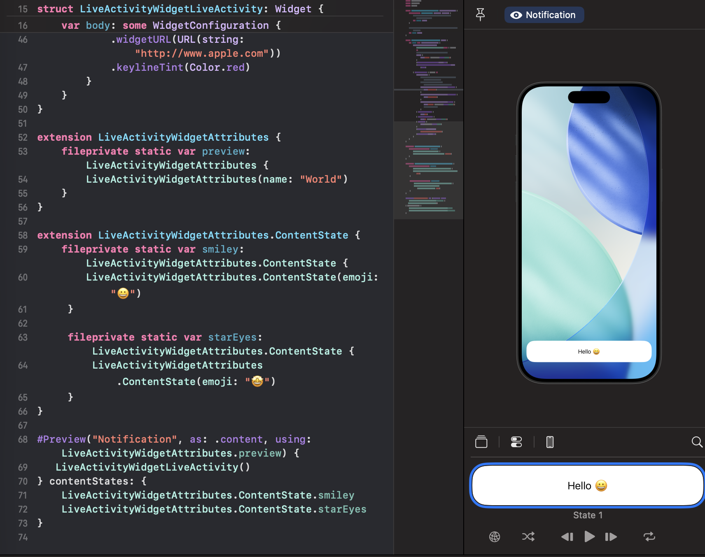
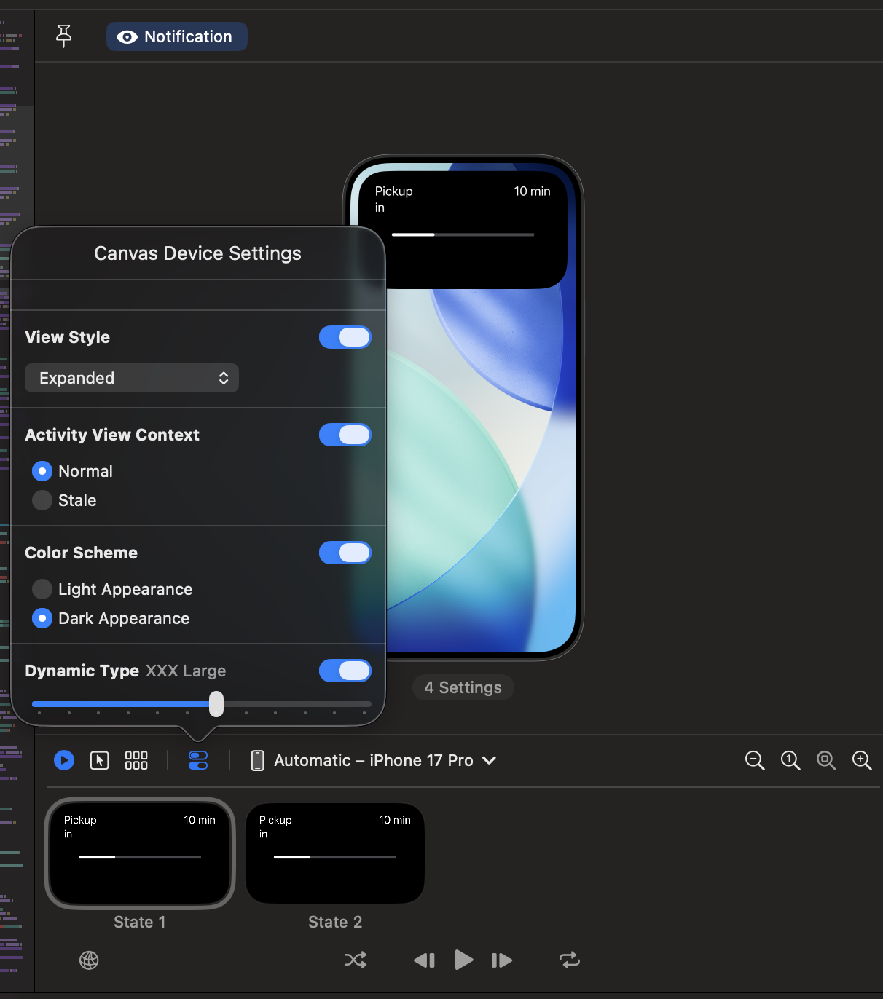

# FlutterByte2025 → Live Activity for Android and iOS Flutter

A cross-platform Flutter application demonstrating **Live Activities** implementation for both Android and iOS platforms. This project showcases real-time delivery tracking with rich notifications on Android and Dynamic Island integration on iOS.


## 📋 Table of Contents

- [Overview](#overview)
- [Features](#features)
- [Screenshots](#screenshots)
- [Architecture](#architecture)
- [Platform Implementations](#platform-implementations)
- [Getting Started](#getting-started)
- [Project Structure](#project-structure)
- [Configuration](#configuration)
- [Usage](#usage)
- [Platform-Specific Details](#platform-specific-details)
- [Troubleshooting](#troubleshooting)
- [Contributing](#contributing)

## 🎯 Overview

This Flutter application demonstrates how to implement **Live Activities** across both Android and iOS platforms, providing:

- **Android**: Rich notifications with custom layouts and progress tracking using RemoteViews
- **iOS**: Native Live Activities with Dynamic Island support for iPhone 14 Pro and newer devices
- **Cross-Platform**: Unified Flutter interface with platform-specific native implementations

The app simulates a **delivery tracking experience** with real-time progress updates, animated indicators, and platform-appropriate UI elements.

## ✨ Features

### 🔔 Core Features
- **Real-time Progress Tracking**: Live delivery progress with percentage and time remaining
- **Cross-Platform Notifications**: Native implementations for both Android and iOS
- **Animated Progress Indicators**: Moving car animation along progress bars
- **Automatic State Management**: Seamless lifecycle management for activities/notifications

### 📱 Android Features
- **Rich Notifications**: Custom notification layouts with RemoteViews
- **Persistent Notifications**: Ongoing notifications during active delivery
- **Custom UI Elements**: Progress bars, icons, and text with Android Material Design
- **Notification Channels**: High and default priority channels for different states

### 🍎 iOS Features
- **Live Activities**: Native iOS 16.1+ Live Activity integration
- **Dynamic Island**: Expanded, compact, and minimal presentations
- **Lock Screen Widgets**: Rich notifications on lock screen and notification center  
- **SwiftUI Integration**: Modern SwiftUI-based user interface
- **ActivityKit Framework**: Official Apple framework for Live Activities

## 📸 Screenshots

### 📱 Flutter App Interface

<div align="center">

| Flutter App | Live Activity Progress |
|-------------|------------------------|
|  |  |

</div>

### 🍎 iOS Dynamic Island & Live Activities

<div align="center">

| Dynamic Island Preview | Expanded Live Activity |
|------------------------|------------------------|
|  |  |

| Live Activity Complete | Group Overview |
|------------------------|----------------|
|  |  |

</div>

### 🤖 Android Rich Notifications

<div align="center">

*Android screenshots coming soon - demonstrating rich notifications with custom RemoteViews layouts*

```
┌─────────────────────────────────────┐
│ 🚚 Delivery Out for Shipment       │
│ Your delivery comes in 8 minutes    │
│ ┌─────────────────────────────────┐ │
│ │ [🚗======>         ] 45%       │ │
│ │ Delivering in • 8 minutes       │ │
│ └─────────────────────────────────┘ │
└─────────────────────────────────────┘
```

</div>

### ✨ Key Features Demonstrated

- **Real-time Progress Updates**: Live progress bar with moving car animation
- **Dynamic Island Integration**: Compact and expanded presentations on iPhone 14 Pro+
- **Lock Screen Widgets**: Persistent delivery information without opening the app
- **Cross-Platform Consistency**: Unified experience across Android and iOS
- **Rich Notifications**: Custom layouts with progress indicators and time estimates

## 🏗️ Architecture

```
┌─────────────────────────────────────────────────────────────┐
│                    Flutter Layer                            │
│  ┌─────────────────┐  ┌─────────────────┐  ┌─────────────┐ │
│  │   main.dart     │  │ LiveNotification│  │   Model     │ │
│  │ (UI Interface)  │  │    Service      │  │   Classes   │ │
│  └─────────────────┘  └─────────────────┘  └─────────────┘ │
└─────────────────────────────────────────────────────────────┘
                              │
                    MethodChannel Bridge
                              │
┌─────────────────────────────────────────────────────────────┐
│                   Native Platforms                         │
│  ┌─────────────────────────┐  ┌─────────────────────────┐   │
│  │       Android           │  │         iOS             │   │
│  │ ┌─────────────────────┐ │  │ ┌─────────────────────┐ │   │
│  │ │   MainActivity      │ │  │ │   AppDelegate       │ │   │
│  │ │ LiveNotificationMgr │ │  │ │ DeliveryLiveActivity│ │   │
│  │ │   RemoteViews       │ │  │ │   ActivityKit       │ │   │
│  │ │ NotificationManager │ │  │ │   SwiftUI           │ │   │
│  │ └─────────────────────┘ │  │ └─────────────────────┘ │   │
│  └─────────────────────────┘  └─────────────────────────┘   │
└─────────────────────────────────────────────────────────────┘
```

## 🚀 Platform Implementations

### Android Implementation
- **File**: `android/app/src/main/kotlin/.../LiveNotificationManager.kt`
- **Technology**: Kotlin, NotificationCompat, RemoteViews
- **Features**: Custom notification layouts, notification channels, progress tracking
- **UI**: Android Material Design with custom RemoteViews layout

### iOS Implementation  
- **File**: `ios/DeliveryActivityE/DeliveryActivityELiveActivity.swift`
- **Technology**: Swift, SwiftUI, ActivityKit, WidgetKit
- **Features**: Dynamic Island integration, Live Activities, lock screen widgets
- **UI**: SwiftUI-based with native iOS design elements

## 🛠️ Getting Started

### Prerequisites

- **Flutter SDK**: 3.8.0 or higher
- **Dart SDK**: Compatible with Flutter version
- **Android Studio**: For Android development
- **Xcode**: 14.0+ for iOS development (macOS only)
- **iOS Deployment Target**: 16.1+ (for Live Activities)
- **Android API Level**: 26+ (Android 8.0)

### Installation

1. **Clone the repository**
   ```bash
   git clone https://github.com/CreativeToby02/live-activity-app.git
   cd live-activity-app/live_activity_frontend/feature_live_activity_app
   ```

2. **Install Flutter dependencies**
   ```bash
   flutter pub get
   ```

3. **iOS Setup** (macOS only)
   ```bash
   cd ios
   pod install
   cd ..
   ```

4. **Run the application**
   ```bash
   # For Android
   flutter run --debug

   # For iOS (macOS only)
   flutter run --debug -d ios
   ```

## 📁 Project Structure

```
lib/
├── main.dart                          # Main Flutter application entry point
└── src/
    ├── model/
    │   └── live_notification_model.dart # Data model for Live Activity state
    └── service/
        └── live_notification_service.dart # Service layer for method channel communication

android/
├── app/src/main/
│   ├── kotlin/.../
│   │   ├── MainActivity.kt             # Android method channel handler
│   │   └── LiveNotificationManager.kt  # Notification management logic
│   ├── res/
│   │   ├── layout/
│   │   │   └── live_notification.xml   # Custom notification layout
│   │   └── drawable/                   # Android assets and icons
│   └── AndroidManifest.xml            # Android app configuration

ios/
├── Runner/
│   ├── AppDelegate.swift              # iOS method channel bridge
│   └── Info.plist                     # iOS app configuration with Live Activity permissions
└── DeliveryActivityE/                 # Widget Extension Target
    ├── DeliveryActivityELiveActivity.swift  # Live Activity SwiftUI implementation
    ├── DeliveryActivityE.swift        # Additional widget implementations
    ├── DeliveryActivityEBundle.swift  # Widget bundle configuration
    ├── Info.plist                     # Extension configuration
    └── Assets.xcassets/               # Shared iOS assets
```

## ⚙️ Configuration

### Android Configuration

#### AndroidManifest.xml
```xml
<uses-permission android:name="android.permission.POST_NOTIFICATIONS" />
<uses-permission android:name="android.permission.VIBRATE" />
<uses-permission android:name="android.permission.WAKE_LOCK" />
```

#### Notification Channels
- **High Priority**: For initial delivery notifications
- **Default Priority**: For ongoing delivery updates

### iOS Configuration

#### Runner/Info.plist
```xml
<key>NSSupportsLiveActivities</key>
<true/>
<key>NSSupportsLiveActivitiesFrequentUpdates</key>
<true/>
```

#### Required Frameworks
- ActivityKit (iOS 16.1+)
- WidgetKit
- SwiftUI
- UserNotifications

## 🎮 Usage

### Basic Implementation

```dart
// Initialize the service
final LiveNotificationService activityService = LiveNotificationService();

// Start Live Activity
await activityService.startNotifications(
  data: LiveNotificationModel(
    progress: 0,
    minutesToDelivery: 10,
  ),
);

// Update progress
await activityService.updateNotifications(
  data: LiveNotificationModel(
    progress: 75,
    minutesToDelivery: 3,
  ),
);

// End activity
await activityService.endNotifications();
```

### Method Channel Interface

The app uses a unified method channel interface:

| Method | Platform | Purpose |
|--------|----------|---------|
| `startNotifications` | Both | Initialize Live Activity/Notification |
| `updateNotifications` | Both | Update progress and time |
| `finishDeliveryNotification` | Both | Mark delivery as complete |
| `endNotifications` | Both | Terminate activity/notification |

## 📱 Platform-Specific Details

### Android Implementation Details

**Key Components:**
- **MainActivity.kt**: Handles Flutter method channel calls
- **LiveNotificationManager.kt**: Manages notification lifecycle and UI
- **live_notification.xml**: Custom RemoteViews layout for rich notifications

**Notification States:**
1. **Initial**: High-priority notification with delivery start
2. **Ongoing**: Persistent notification with progress updates  
3. **Completed**: Final notification with delivery confirmation

**Features:**
- Custom notification channels for priority management
- RemoteViews for complex UI layouts
- Progress bars with animated indicators
- Auto-canceling completion notifications

### iOS Implementation Details

**Key Components:**
- **AppDelegate.swift**: Flutter-iOS bridge with method channel handling
- **DeliveryActivityELiveActivity.swift**: SwiftUI Live Activity implementation
- **DeliveryProgressCard**: Reusable SwiftUI component for consistent UI

**Dynamic Island Presentations:**
- **Expanded**: Full delivery information with progress and details
- **Compact**: Essential info with time and progress indicator
- **Minimal**: Time remaining only

**Live Activity Features:**
- Real-time updates without app interaction
- Lock screen and Dynamic Island integration
- Automatic lifecycle management
- SwiftUI animations and transitions

## 🔧 Troubleshooting

### Common Issues

#### Android Issues
```
Problem: Notifications not appearing
Solutions:
- Check notification permissions (Android 13+)
- Verify notification channels are created
- Ensure app is not in battery optimization

Problem: Custom layout not displaying
Solutions:
- Verify RemoteViews package name matches app package
- Check layout XML for syntax errors
- Test on different Android versions
```

#### iOS Issues
```
Problem: Live Activities not showing
Solutions:
- Check iOS version (16.1+ required)
- Verify Live Activities enabled in Settings
- Ensure NSSupportsLiveActivities in Info.plist
- Test on physical device (not simulator for some features)

Problem: Dynamic Island not appearing
Solutions:  
- Use iPhone 14 Pro+ or later
- Check DynamicIsland implementation in SwiftUI
- Verify widget extension configuration
```

#### Flutter Issues
```
Problem: Method channel errors
Solutions:
- Verify channel name matches across platforms
- Check argument types and structure
- Ensure platform-specific code is properly registered
- Add proper error handling for unsupported platforms
```

### Debug Commands

```bash
# Flutter logs
flutter logs --verbose

# Android logs (specific to notifications)
adb logcat | grep LiveNotification

# iOS logs (Live Activities)
xcrun simctl spawn booted log stream --predicate 'subsystem contains "ActivityKit"'
```

## 🤝 Contributing

1. Fork the repository
2. Create your feature branch (`git checkout -b feature/amazing-feature`)
3. Commit your changes (`git commit -m 'Add amazing feature'`)
4. Push to the branch (`git push origin feature/amazing-feature`)
5. Open a Pull Request

### Development Guidelines

- Follow Flutter/Dart style guidelines
- Add platform-specific comments for complex implementations  
- Test on both Android and iOS devices
- Update documentation for new features
- Include error handling for edge cases

## 📚 Additional Resources

### Flutter Resources
- [Flutter Documentation](https://docs.flutter.dev/)
- [Method Channels Guide](https://docs.flutter.dev/development/platform-integration/platform-channels)
- [Flutter Platform Integration](https://docs.flutter.dev/development/platform-integration)

### Android Resources  
- [Android Notifications Guide](https://developer.android.com/guide/topics/ui/notifiers/notifications)
- [RemoteViews Documentation](https://developer.android.com/reference/android/widget/RemoteViews)
- [Notification Channels](https://developer.android.com/training/notify-user/channels)

### iOS Resources
- [ActivityKit Documentation](https://developer.apple.com/documentation/activitykit)
- [Live Activities Human Interface Guidelines](https://developer.apple.com/design/human-interface-guidelines/live-activities)
- [WidgetKit Framework](https://developer.apple.com/documentation/widgetkit)
- [SwiftUI Animation Guide](https://developer.apple.com/documentation/swiftui/animation)

---

## 📄 License

This project is licensed under the MIT License - see the LICENSE file for details.


---

**Note**: This project demonstrates advanced cross-platform integration techniques for Live Activities. The implementation provides a solid foundation for production applications requiring real-time notifications and Live Activity features across both major mobile platforms.
# FlutterByte2025-Live-Acitivity-for-Android-and-iOS-flutter
# FlutterByte2025-Live-Acitivity-for-Android-and-iOS-flutter
